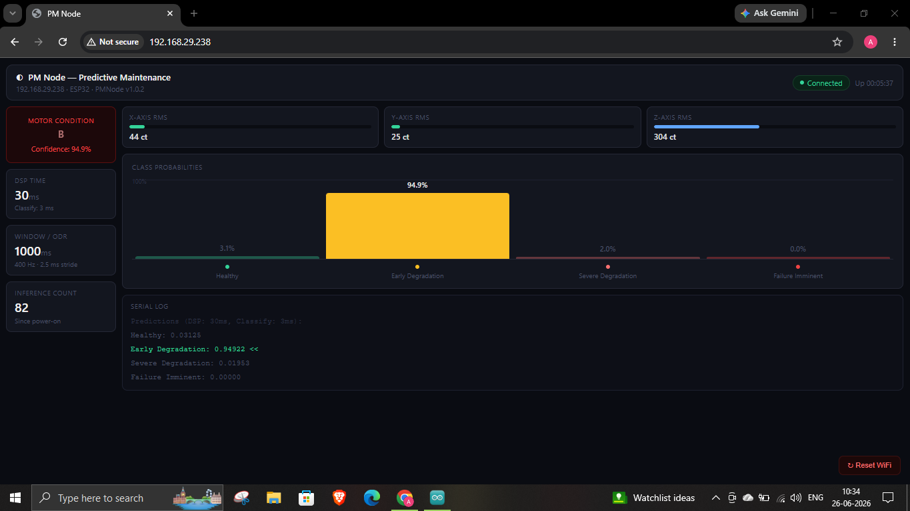
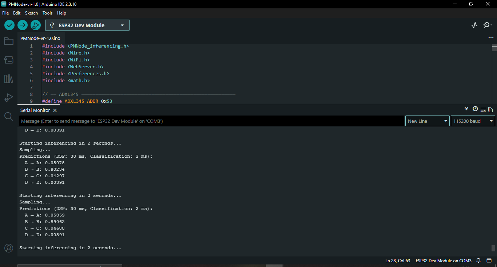
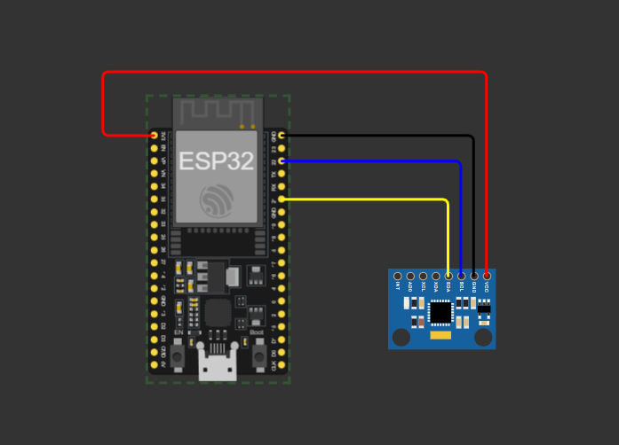

# ESP32 PM Node — TinyML Motor Imbalance Fault Classifier

> Real-time motor health monitoring using TinyML on ESP32 with ADXL345 vibration sensing, Edge Impulse classification, and a live WiFi dashboard.


---

## Demo

| Dark-mode dashboard | Serial output |
|---|---|
|  |  
|    | 

---

## Overview

PM Node is an end-to-end embedded ML system that classifies DC motor health in real time using vibration data. An ADXL345 accelerometer samples at 400 Hz, an Edge Impulse model runs inference on-device every ~3 seconds, and results are served live to any browser over WiFi — no cloud required.

**4 health classes:**

| Label | Meaning |
|---|---|
| `A` | Healthy |
| `B` | Early Degradation |
| `C` | Severe Degradation |
| `D` | Failure Imminent |

---

## System Architecture

```
ADXL345 (400 Hz, I2C)
      │
      ▼
ESP32 — samples 400-point window (1000 ms)
      │
      ▼
Edge Impulse model (DSP: FFT 512 → 582 features → NN classifier)
      │
      ├──► Serial Monitor (predictions + timing)
      │
      └──► WebServer /dashboard  ←── Browser (polls /data every 2s)
```

---

## Hardware

| Component | Details |
|---|---|
| Microcontroller | ESP32 (30-pin DevKit) |
| Accelerometer | ADXL345 (I2C, addr `0x53`) |
| Motor (test rig) | DC gearmotor 200/300 RPM |
| Power | USB 5V |

### Wiring

| ADXL345 Pin | ESP32 Pin |
|---|---|
| VCC | 3.3V |
| GND | GND |
| SDA | GPIO 21 |
| SCL | GPIO 22 |
| CS | 3.3V (forces I2C mode) |
| SDO | GND (sets address to 0x53) |

---

## ML Model Details

| Parameter | Value |
|---|---|
| Accuracy | 100% on controlled test set (single motor, fixed mounting, lab conditions) |
| Framework | Edge Impulse |
| Sensor | ADXL345 (X, Y, Z axes) |
| Sample rate | 400 Hz |
| Window size | 2000 ms |
| Stride | 500 ms |
| DSP | Spectral Analysis — FFT 512 |
| Features | 582 |
| Classes | 4 |
| Anomaly detection | None |

Training data was collected at 400 Hz in raw ADC counts (no unit conversion) across 4 motor health states using a DC gearmotor test rig.

> 🔗 **Edge Impulse Public Project:** [View model, DSP pipeline, and training results →](https://studio.edgeimpulse.com/public/1030847/live)

---

## Software Dependencies

Install these in Arduino IDE (`Sketch → Include Library → Manage Libraries`):

| Library | Install from |
|---|---|
| `PMNode_inferencing` | Extract the `.zip` from Edge Impulse → add via `Sketch → Add .ZIP Library` |
| `Wire` | Built-in (Arduino) |
| `WiFi` | Built-in (ESP32 Arduino core) |
| `WebServer` | Built-in (ESP32 Arduino core) |
| `Preferences` | Built-in (ESP32 Arduino core) — used for NVS credential storage |

**ESP32 Arduino Core** — add this URL to `File → Preferences → Additional Boards Manager URLs`:
```
https://raw.githubusercontent.com/espressif/arduino-esp32/gh-pages/package_esp32_index.json
```

---

## Getting Started

### 1. Clone the repo

```bash
git clone https://github.com/ApurvSahu/ESP32-PMNode-Predictive-Maintenance.git
cd ESP32-PMNode-Predictive-Maintenance
```

### 2. Connect to WiFi (captive portal — no credentials in code)

No hardcoded credentials needed. The firmware uses a **WiFi provisioning captive portal**:

1. On first boot, the ESP32 starts a setup access point called **`PMNode-Setup`** (open, no password)
2. Connect your phone or laptop to **`PMNode-Setup`**
3. A setup page opens automatically — if it doesn't, navigate to `http://192.168.4.1`
4. Tap **Scan**, select your network, enter the password, and tap **Connect & Save**
5. Credentials are saved to NVS (non-volatile storage) and survive reboots
6. The ESP32 restarts and connects — your dashboard IP is printed on Serial Monitor

> **To switch networks later:** open the dashboard in your browser and click the **Reset WiFi** button (bottom-right corner). The ESP32 clears its saved credentials and reboots into setup mode.

### 3. Add the Edge Impulse library

- Download `PMNode_inferencing` from your Edge Impulse project → Arduino library
- In Arduino IDE: `Sketch → Include Library → Add .ZIP Library` → select the zip
- Rename the extracted folder to `PMNode` if you hit Windows MAX\_PATH errors

### 4. Flash the firmware

- Open `firmware/pm_node_wifi.ino` in Arduino IDE
- Select board: `ESP32 Dev Module`
- Select the correct COM port
- Click Upload

### 5. Open the dashboard

- Open Serial Monitor at **115200 baud**
- On first boot: connect to **`PMNode-Setup`** WiFi → follow the captive portal to enter your network credentials
- After provisioning, the ESP32 reboots and prints: `Dashboard: http://192.168.x.x`
- Open that URL in any browser on the same WiFi network

---

## Dashboard Features

- Live motor condition card (green / amber / red / pulsing red)
- Per-axis RMS vibration bars (X, Y, Z)
- Vertical probability bar chart for all 4 classes
- DSP and classification timing
- Inference count and uptime
- Auto-reconnect indicator
- Polls `/data` endpoint every 2 seconds — no page refresh needed
- **Reset WiFi** button to re-run provisioning without reflashing

---

## Project Structure

```
ESP32-PMNode-Predictive-Maintenance/
├── firmware/
│   └── pm_node_wifi.ino        # Main Arduino sketch (WiFi via captive portal — no secrets file needed)
├── data/
│   ├── healthy.csv
│   ├── early_degradation.csv
│   ├── severe_degradation.csv
│   └── failure_imminent.csv
├── docs/
│   ├── dashboard_screenshot.png
│   ├── serial_output.png
│   └── wiring_diagram.png
└── README.md
```

---

## Limitations & Future Work
- Trained on single motor at fixed RPM and mounting position
- Detects mass imbalance only — bearing wear, misalignment, and 
  looseness not yet covered
- Real-world deployment would require retraining across multiple 
  motors and operating conditions
- No anomaly detection enabled in current model

## Roadmap

- [x] ADXL345 data collection at 400 Hz
- [x] Edge Impulse model training (4 classes)
- [x] On-device inference on ESP32
- [x] WiFi dashboard with live UI
- [x] WiFi provisioning captive portal (no hardcoded credentials)
- [ ] MQTT publish to broker (Node-RED / Home Assistant)
- [ ] SD card CSV logging with timestamps
- [ ] OTA firmware updates
- [ ] FreeRTOS dual-core architecture
- [ ] Model retraining pipeline
- [ ]  Multi-motor dataset collection for generalization
- [ ] Bearing fault detection (new fault class)
- [ ] RPM-aware classification

---

## Skills Demonstrated

`Embedded C/C++` · `TinyML` · `Edge Impulse` · `ESP32` · `I2C` · `ADXL345` · `FFT / DSP` · `WiFi WebServer` · `Predictive Maintenance`

---

## Author

**Apurv Sahu** — B.Tech ECE, Pranveer Singh Institute of Technology, Kanpur  
GitHub: [@ApurvSahu](https://github.com/ApurvSahu)

---

## License

MIT License — free to use, modify, and distribute with attribution.
